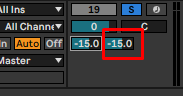
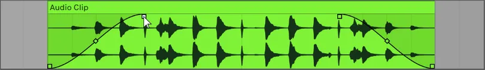

# Compression

https://www.musicindustryhowto.com/what-is-compression-in-music-production-when-to-use-audio-compression-explained/

A compressor is basically an automated volume fader that turns down the peaks of your track – making it more even and easier to turn up in the mix. Compression squashes the waveform. That way, the track as a whole become more even.

Then, you can bring up the overall volume of the track and it will sit nicely in your mix. You can use compression to make things punchier, to shape a sound, to obtain a nice balance and so much more. 

## Threshold

Possibly the most important knob on any compressor is the threshold. The threshold is what allows the compressor to compress the track and control how much compression is applied. If the threshold is at zero, you can do whatever you want to the other knobs and nothing will happen. No compression will take place. Threshold is essentially just the volume at which the compressor turns down the signal.

 So, if you turn the threshold down just a little bit, it will only affect the very loudest points in the track. This is referred to as a very soft or light compression.

If you turn the threshold down further, the signal will get even more squashed. It will begin to affect the loud peaks as well as the peaks that are quieter. You can squash a signal to the point where it no longer has any dynamics.

## Ratio

This knob was always a little bit mysterious to me. I had read a few tutorials and found through trial and error that a 2:1 ratio tended to sound the best, but I still didn’t really know what it was doing.

However, it’s actually not very complicated. The Ratio knob works in conjunction with the Threshold. The Ratio determines how hard the compressor will kick in when the volume crosses the threshold.

So, a 1:1 ratio means the signal doesn’t get turned down at all when the volume crosses the threshold. A 2:1 ratio means the compressor will turn the signal down by half when it crosses the threshold. The higher the ratio, the harder the compressor will work. You can experiment with the ratio and the threshold to get as much or as little compression as you need.

## 

# Operator

https://www.ableton.com/en/packs/operator/

Operator is a versatile, easy-to-use and great-sounding software instrument combining classic analog sounds and frequency modulation synthesis, perfectly integrated in Live's award-winning interface.

# Reverb

https://www.musicgateway.com/blog/how-to/reverb

Reverb is the persistence of sound after a sound is produced. Reverb is created when a sound or signal is reflected off of a surface causing numerous reflections to build up. They then decay as the sound and reflections are absorbed by the surfaces of the objects around it. The original sound source can stop but the reflections continue, decreasing in amplitude (volume) until they reach zero. Reverb defines how a sound sits in a space. In all aspects of our daily lives, we experience the effects that reverb has on the sounds that we hear.

# Delay

Number tels how much percent of the song should be affected by the delay

https://www.renegadeproducer.com/delay-effects.html

Delay is an effect process that takes incoming signals and plays back delayed duplicates to simulate the sound of echoes.

An echo occurs in real-world acoustic spaces where the reflection surface is far enough away from the sound source and listener to make the reflection sound like a distinct separated repeat or tap of the original sound. This can be heard for example when you scream something into a well.

Two identical sounds, when played in rapid succession with a delay between them of 1ms to 50ms, will appear as one fused sound to a listener. Any delay time longer than this will start to sound more like a distinct echo.

Reverb, flange and chorus effects are all delay-based effects where the delay parameters are adjusted or the signal modulated to create different-sounding end results to that of a straight delay effect.

# Audio Pan

Panning audio **lets you distribute sound across the stereo or surround spectrum to create balance or a special effect**. For example, you can place more sound in the right channel of a stereo clip or less sound in the center channel of a surround clip.

# Audio Clip Edit

https://liveaspects.com/how-to-edit-audio-in-ableton-live/

## What exactly is the fade effect?

https://musicalstudy.com/important-to-use-fades/

The fade is a sound effect that professional audio engineers would use in editing sounds. The fade is **a decrease or increase in the volume** of the sound. Fades can make a sound appear to start “fading in” or “fading out” when it slowly appears or disappears respectively.

The fade-out effect is often used in different types of music to signify that there is no end to the song. The song just slowly fades away as it ends until it cannot be heard anymore. Ballad songs and slow songs, in particular, sound better with a fade than with an abrupt stop.

Fade-ins, on the other hand, are used during the beginning of a song. This effect is often used when the introduction of a song starts with drums. The drums then become louder and louder as the song progresses.

## **How To Fade In & Out**

Fading an audio clip in or out can be achieved using the fade handles. Fade handles appear as small square boxes in the corners of an audio clip. Simply hover over an audio clip with your mouse to reveal the fade handles, then click and drag left or right to create a fade. You can change the shape of the fade by adjusting the diamond-shaped fade handles.

#  **What Is Automation?**

Automation is a powerful tool found in popular DAWs that automatically controls parameters across the timeline of a mix. It is used to automatically adjust faders, knobs or buttons that control parameters within a track or plug-in. Automation can help avoid repetition, create variation and build a sense of anticipation
