# Section 3

## Perfect fifth

An **interval** is just the distance between two notes. The name perfect 5th comes from the idea of a scale. For example the C major scale consists  of the following notes:

```
C D E F G A B
```

The 5th note of the scale is G hence the 5th of the C major scale is G.

A 5th that is 7 semitones up from the root is perfect, but where the term perfect from is a bit debatable.*

Waveforms

Fifth = 1500 mhz

Others = 1000 mhz

Interval of fifth, menas eg. C2 and G2. Between C2 and G2 we have 3 white notes on the keyboard


## The pattern of a key

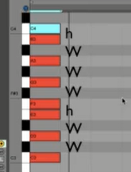

Half step (h) - no note between
Full step (W) - one note between

The note where we start the pattern is a **KEY**

Finding 3th in the major scale


## 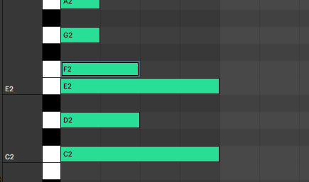

from c2  => e2 is a 3th

from d2  => f2 is a 3th


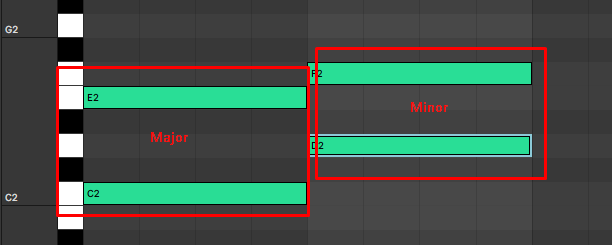

from c2  => e2 is a 3th, it is major because it has more half steps

from d2  => f2 is a 3th, it is minor because it has less half steps


# Section 4

## Chord

Chord is when you have more then one not at a time

## Triad

Is a chord made up three different notes

Then name of the cord tells where the root is 

eg:

- G minor cord - root will be g
- C major cord - root will be c


Major triad:

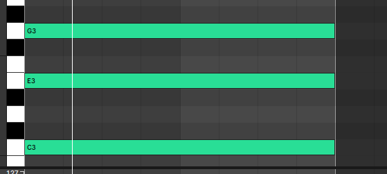

## Chord progression

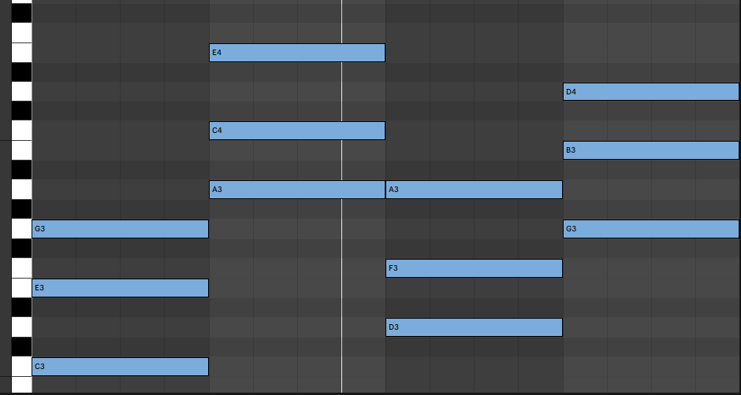

Chord progression is made up from some minor and major chords


# Section 5

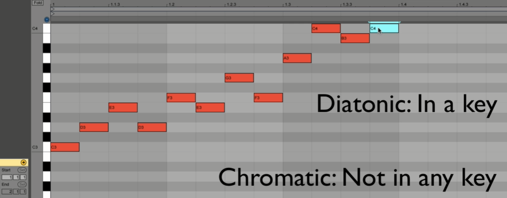

## Diatonic chord progression

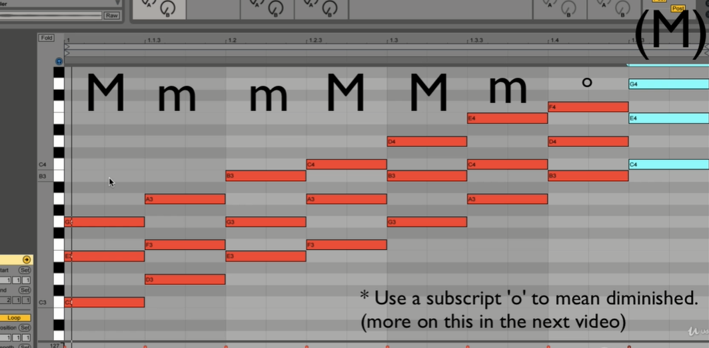

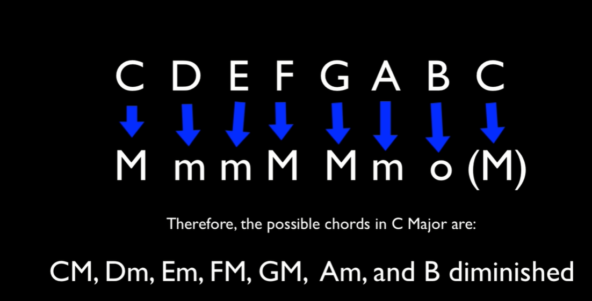

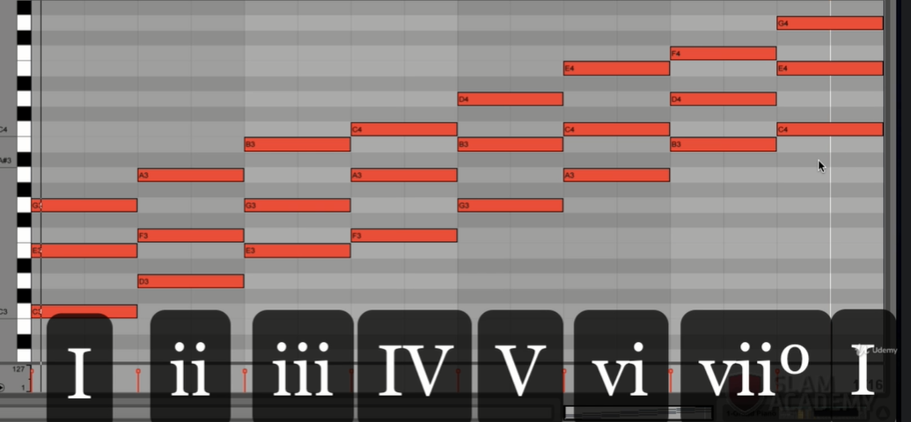

## Inversion

Inversion means reordering notes (different from root note) to another octave

From:

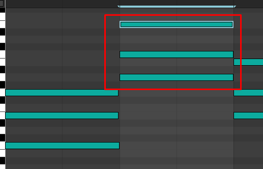

To:

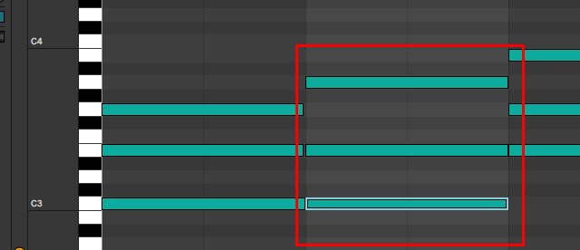


Section 6

## 7th chord

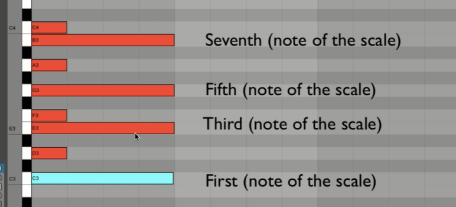

## Major 7

## Major 7 is when we are half step from a root note of a higher octave

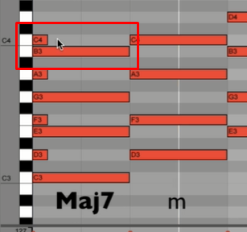

## Minor 7 

## Minor 7 is when we are full step from a root note of a higher octave


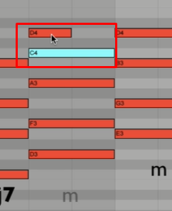

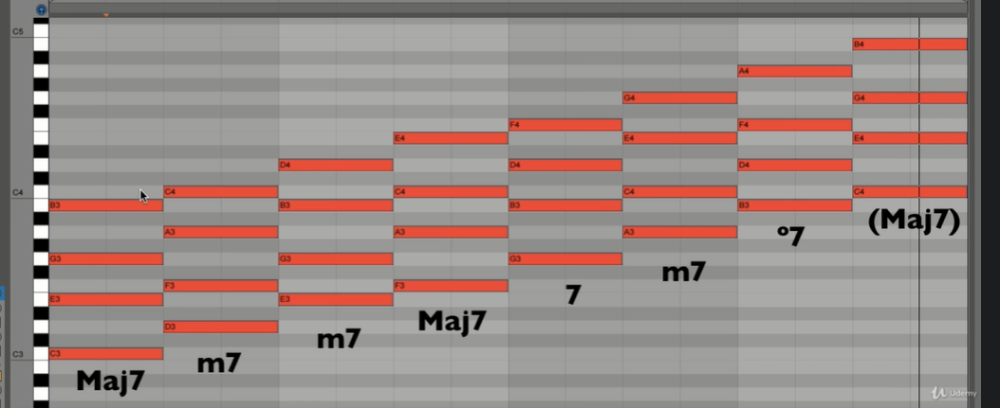


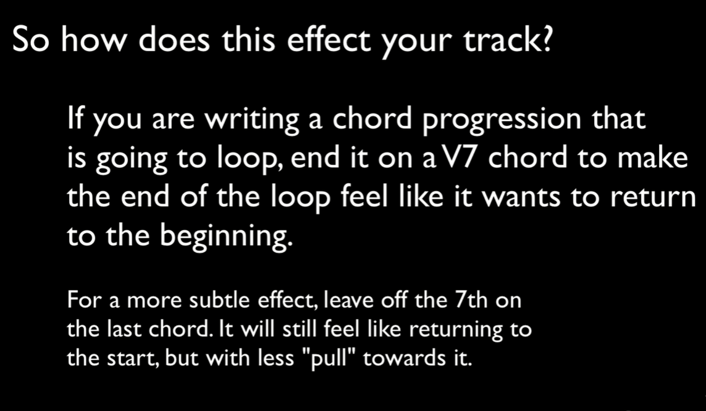

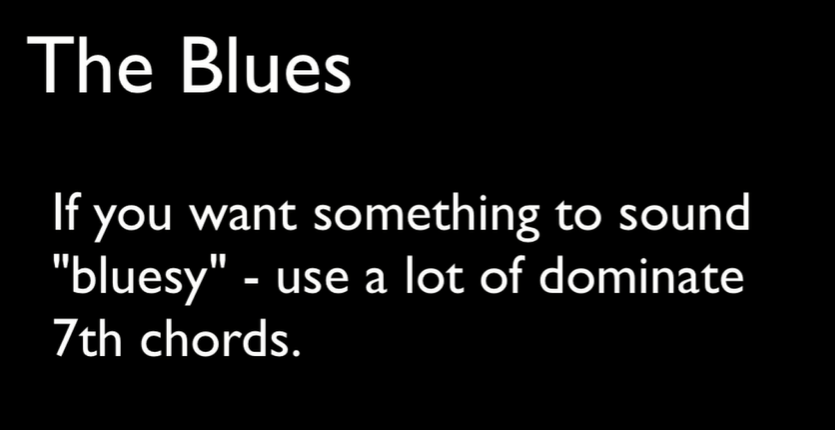

Flat seven?
