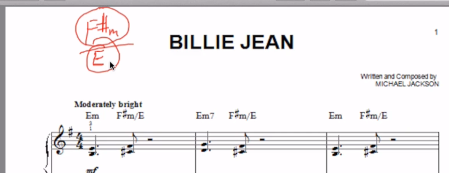

# Natural, sharp and flat notes

https://hellomusictheory.com/learn/sharps-flats-and-natural-signs/


Flat note - mean note one half step down, eg. flat 13th means last note need to be pull down half step

# Major scale

The **major scale** (or [Ionian mode](https://en.wikipedia.org/wiki/Ionian_mode)) is one of the most commonly used [musical scales](https://en.wikipedia.org/wiki/Scale_(music)), especially in [Western music](https://en.wikipedia.org/wiki/Western_culture#Music). It is one of the [diatonic scales](https://en.wikipedia.org/wiki/Diatonic_scale). Like many musical scales, it is made up of seven [notes](https://en.wikipedia.org/wiki/Musical_note): the eighth duplicates the first at double its [frequency](https://en.wikipedia.org/wiki/Frequency) so that it is called a higher [octave](https://en.wikipedia.org/wiki/Octave) of the same note (from Latin "octavus", the eighth).

# Section 3

## Perfect fifth

An **interval** is just the distance between two notes. The name perfect 5th comes from the idea of a scale. For example the C major scale consists  of the following notes:

```
C D E F G A B
```

The 5th note of the scale is G hence the 5th of the C major scale is G.

A 5th that is 7 semitones up from the root is perfect, but where the term perfect from is a bit debatable.*

Waveforms

Fifth = 1500 mhz

Others = 1000 mhz

Interval of fifth, menas eg. C2 and G2. Between C2 and G2 we have 3 white notes on the keyboard


## The pattern of a key (major scale)


Half step (h) - no note between
Full step (W) - one note between

The note where we start the pattern is a **KEY**


Finding 3th in the major scale


## 

from c2  => e2 is a 3th

from d2  => f2 is a 3th


from c2  => e2 is a 3th, it is major because it has more half steps

from d2  => f2 is a 3th, it is minor because it has less half steps


# Section 4

## Chord

Chord is when you have more then one not at a time

## Triad

Is a chord made up three different notes

Then name of the cord tells where the root is 

**Triads** are made up of 3 notes played on top of each other. You will often hear people describe triads as chords. They consist of a bottom note (**root**), a middle note (**3rd**) and a top note (**5th**):

eg:

- G minor cord - root will be g
- C major cord - root will be c


Major triad:


### Components Of A Triad

A triad has three components:

> The root
>
> The third
>
> The fifth

The components are derived from the order of the tones in a given scale. For example, the C major triad:

…can be broken down into the following components:

> C is the **root**
>
> E is the **third**
>
> G is the **fifth**
>
> The C major triad:
> 
> The C minor triad:
> 
> The C augmented triad:
> 
> The C diminished triad:
> 


## MAJOR  TRIADS

The interval of the major third is two whole steps, so if we wanted to create a C major chord, we would have C as our root, then we would move up two whole steps to our major third, E, for our second note in the chord. From there, we can think of adding the final note in two different ways: either by moving up a **minor third** from the E, *or* moving up a **perfect 5th** from our root, C.


## MINOR  TRIADS

Minor chords are made in much the same way as major chords, except the thirds are reversed. This means that instead of moving up a major third from your root note (let’s stick with C), we would first move up a **minor third**, and then we would add a **major third** on top of that (or a perfect fifth above the root) to complete the chord.

A minor third is a whole step plus a half step, so if we start on C, we would move up to **E-flat** as opposed to the E natural in the major chord discussion above. From there we would move up a **major third** to reach our last note, G.


## Chord progression


## What is a chord progression?

https://www.musical-u.com/learn/what-is-a-chord-progression/#

 by [Musical U Team](https://www.musical-u.com/learn/author/team/) | [Chord Progressions](https://www.musical-u.com/learn/topic/ear-training/chord-progressions/) | 

**A chord progression (or just “progression”) is a sequence of chords played one after another.**

If there are just two, it’s called a *cadence* rather than a progression.

There are particular common chord progressions which are used again  and again in popular music, because certain chords work well together to create moods and a satisfying sense of progress in music. This leads to a large number of [“3 chord songs”](https://www.musical-u.com/learn/topic/ear-training/chord-progressions/3-chord-songs/) and [“4 chord songs”](https://www.musical-u.com/learn/topic/ear-training/chord-progressions/4-chord-songs/).


# Section 5


## Diatonic chord progression

It tells all the available chords in the key that you are woking.

This are all the notes combination from a particular note, eg if the root is C chord progression would be all notes in the pattern (1,3,5), starting from each note the scale.


## Inversion

Inversion means reordering notes (different from root note) to another octave

From:


To:


# Section 6

## 7th chord


## Major 7


Major 7 is when we are half step from a root note of a higher octave


## Minor 7 

Minor 7 is when we are full step from a root note of a higher octave  


# Section 7

4th - is a inversion of a 5th 

5th - is a inversion of a 4th


When we invert the interval it becomes opposite, major becomes minor

Song analysis:


# Section 10 

## Minor scale

https://www.masterclass.com/articles/minor-scale-guide#what-is-a-minor-scale

In music theory, a minor scale is a seven-note musical scale that  features a minor third scale degree (also known as a flat third). The  sound of the minor scale can evoke sadness, eeriness, and suspense.  Minor chords and minor-key music use notes from a minor scale.


standard minor scale

## 

## What Is the Difference Between Major and Minor Scales?

The primary difference between major scales and minor scales is the third  scale degree. A major scale always has a natural third (or major third). A minor scale never has a major third. In practice, you can add any  note as a tension to a minor scale *except* for a major third. For example, if you are playing a D minor scale, almost any note can arguably sound good in this scale *except for F♯*. If you play an F♯, the scale instantly takes on a major tonality.

Natural minor scales share a key signature with a [relative major key](https://www.masterclass.com/articles/guide-to-relative-scales-in-music) that has the same diatonic notes. For example, the D minor scale is the relative minor of F major. The E minor scale is the relative minor of G major.


### Harmonic minor scale 

7th note is going up for half step


### Melodic minor scale

6th note is going up for half step


## Relative keys

https://www.masterclass.com/articles/guide-to-relative-scales-in-music#what-is-the-difference-between-relative-keys-and-parallel-keys

Relative keys are pairs of major and minor musical keys that share the  same set of notes. When these notes are played in a certain order, they  can “happy” (major key); when the same keys are played in the relative  order, they sound “sad” (minor). 

Both the C major scale and the A natural minor scale use only natural  notes with no flats or sharps. If you start the scale on the note C, the notes in order will be C-D-E-F-G-A-B—this is the C major scale. If you  play these same notes, but start on the note A, the notes in order will  be A-B-C-D-E-F-G—this is the A natural minor scale. In this case, A  minor is the relative minor of C major, and C major is the relative  major of A minor. All major keys have a relative minor key that uses the same notes, and vice versa.


### How to Find the Relative Minor of a Major Key

You can find the relative minor of a major scale by finding that scale's  sixth scale degree—the sixth note in the scale. For instance, the D  major scale goes D-E-F♯-G-A-B-C♯. **The sixth scale degree is B**.  Therefore, the relative minor of D major is the key of B minor. In fact, you can create a B minor scale by simply starting a D major scale on  the note B. You'll end up using all the same notes, but you'll be  playing in a different key.


## Minor Diatonic chord progression


All chords we can use from a key of A minor:


# Section 11 - song analysis tips


1. Find a proper key, eg. it can be to not which appear frequently

2. Check the scale notes are in, you can draw the scale and check if all notes appear in the scale from the root key (point 1)

   

3. Detect the chord progression, eg below is the A minor scale chord progression

   

 Section 12 - the circle of fifths

# 


Closely related key (modulation key)

For C it is F and G

In chord progression moving to common notes make nicer sound

## Changing key in the track

We can change the key of the scale if there are not many differences between notes used in the particular scale, the are **closely related** in the circle of fifths  eg


In the above picture C major scale and G major scale have only one difference F#

Every step from a note on the circle of fifths means one note difference, we can also move from major scale note to relevan note in minor scale


Section 13 - Song analysis (Get Lucky)

E minor do not match, sounds do not fit, this is whya we need to search close note from the circle of fifths


In the circle of fifths we need to check notes which are close to B minor (this is our key)


We did change E minor to E major form a F# minor scale(E is a 7th note in the row from the F# minor scale and this is whay it is major), which is closely related to B minor


# Section 14 - more chord extensions

## Dominant 7th chord in major scale

Is when we move 7th note, half step down


## 9th and 13 th

We can create higher chords by coping note from a particular scale to octave higher. 

Eg. with usage of 9th the sound is more thicker and similar to jazz music


## Suspended chords

https://hellomusictheory.com/learn/suspended-chords/

A **Suspended Chord** is unique because it’s not made from 3rds. Chords made by stacking 3rds are called **tertian** chords, and Suspended chords are non-tertian. Instead, a suspended chord has a note within it that is “suspended” either a 4th or a 2nd above the root note. 

For example, starting on the note G, a typical G Maj chord would be G – B – D.  A suspended chord keeps the two outer notes (the G and the D), but  the B is changed for the note either a 4th above G or a 2nd above G. The note a 2nd above G is A, and the note a 4th above G is C, so the two suspended G chords are G – A – D and G – C – D. 


Suspended Chords are really similar to something called "add" chords. Both of them typically deal with the 2nd and 4th being added to the chord. But the difference is that in suspended chords, you do **replace the third** with the added note. But in "add" chords, you **keep the third** in addition to the added note.

For example:

Csus2: C-D-G (the D replaces the third (E)).

Cadd2: C-D-E-G (The D is in addition to the third)

Csus4: C-F-G (The F replaces the third)

Cadd4: C-E-F-G (The F is in addition to the third)


## Reading a chord chart


The amount of "#" or "b" tells us in which key we are, see the below circle


meaning if we have  one "#" we go to the right of the circle and we are in the key of G (or Em). On the other hand if we have one "b" we go to the left and we are in the key of F (or Dm)


Or second chord is F# minor, but "#" indicates that we need the change it to the minor chord by raising 5th note up one half step




Above means that we need to add E as a base to the F#m chord


