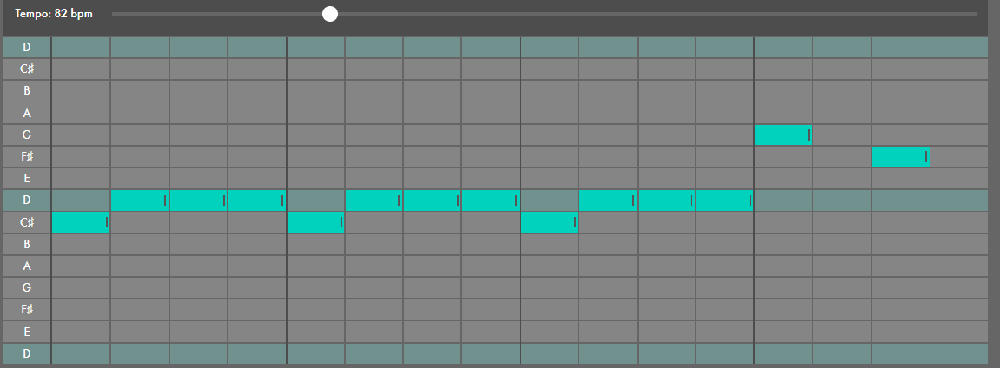

# Drums

## Kick

Also called a *bass drum*, an acoustic kick is struck by a pedal with a beater attached, and is played by the drummer's foot. Electronic versions of this sound are sometimes made to sustain much longer than the relatively short sound produced by a physical drum.

## Clap

This is the sound of one or more people clapping their hands. Today, electronic, stylized versions of this sound (like the one used here) are much more common than actual recordings of handclaps.

## Snare

A *snare drum* is struck with a drum stick, and produces a short, bright sound. A set of wires (called *snares*) is stretched across a *drum head* at the bottom of the drum. The vibration of the bottom drum head against the snares produces the drum's characteristic "cracking" tone.

Claps, snares, and other "sharp" or "bright" sounds are often used in similar ways in drum patterns.

## Closed Hat and Open Hat

These are two different sounds created by an instrument called the *hihat*. Hihats are a pair of small cymbals mounted on a stand. The top cymbal is attached to a rod that is raised and lowered with a foot pedal. Hihats are "closed" when the drummer's foot is down, which presses the cymbals together. They are "open" when the drummer's foot is raised and the cymbals are not touching. On an acoustic drumset, there is a huge range of states in between the open and closed position, and each state creates a different type of sound.

If you play a closed hihat while an open hihat sound is still being heard, the closed sound will "win," and stop the open sound immediately. This matches the way hihats behave in the real world; the hihat can't be open and closed at the same time. Hihats work this way throughout these lessons.

# Beat and tempo

## What's a "beat?"

People commonly use the word "beat" to mean "a pattern (or *rhythm*) played by drums." The thing you're making when you create and play patterns in these lessons is "a beat."

But, confusingly, there's another use of the word "beat," which means "a regular, repeating pulse that underlies a musical pattern." People tap their foot along with "the beat" in this context.

## Tempo

The speed at which your patterns play back is called the *tempo*. Tempo is measured in *beats per minute* or *BPM*. So if we talk about a piece of music being "at 120 BPM," we mean that there are 120 beats (pulses) every minute.

Some types of musical patterns have a very clear underlying beat, while others have a more subtle or implied one. To hear a steady beat, add notes on the Kick line at the positions labeled 1, 5, 9, and 13.

This pattern is so common that it even has its own name: "four on the floor."

Now try adding some notes for the top three rows, but leave the Kick row alone. Notice that no matter what you do in the other rows, the steady pattern in the Kick line makes it really hard to lose the sense of clear pulse.

## Tempo and genre

The style (or *genre*) of a piece of music is determined by a number of factors, including the types of sounds and patterns used, and also the tempo.

You probably have some idea about the genre of a song when you hear it, just based on your experiences as a music listener. Here are "typical" tempo ranges for a number of common genres:

- Dub: 60-90 bpm
- Hip-hop: 60-100 bpm
- House: 115-130 bpm
- Techno/trance: 120-140 bpm
- Dubstep: 135-145 bpm
- Drum and bass: 160-180 bpm

## Backbeats

In the empty grid below, do the following:

1. Create the "four on the floor" pattern in the Kick row again.
2. Add notes in the Clap row at the positions labeled 5 and 13.

Many styles of music that are "in four" feature a clap or snare on the second and fourth beat, a pattern known as a *backbeat*.

This combination of four-on-the-floor kicks with backbeat claps or snares is commonly used in many genres such as techno and house.

## Bars

So far, all of the drum patterns you've looked at loop back to the beginning after four beats. This grouping of four beats is called a *bar* or *measure*.

Songs are made by putting multiple bars of music together to form larger sections, and then putting these larger sections together.

# Notes and Scales

## Pithch

*pitch*, which is the relative "highness" or "lowness" of sound.

## Scale

You can think of a scale as something like an artist's palette of paint. It's a subset of all available notes, chosen because of the way they relate to each other. Each type of scale has a distinct sound, and many people have particular emotional associations with particular scales.

You can build scales by adding more notes at specific distances (or *intervals*) above the tonic. The two most common types (or *qualities*) of scales are major and *minor*.

## Chromatic Scale

This is another type of scale, called the *chromatic* scale.

(The black keys on the piano can also be represented with the ♯ (*sharp*) symbol. "A♯/B♭" is read as "A sharp" or "B flat.")

When working with all 12 notes, you might have found that it's easy to make patterns that sound unusual or "wrong." Most music makes use of only smaller subsets of these 12 notes (such as the seven notes of the major or minor scales), and we're used to hearing music with this smaller number of pitches.

# Chords

## Major triads

The most common chords are *triads*, which are built by adding the third and fifth notes in the scale above a starting note (or *root*). For example, in C major, the triad built on C contains:

- C (the root)
- E (the third note above C; often called just "the third")
- G (the fifth note above C; often called just "the fifth")

This is called the *C major triad*.

## Minor triads

In C minor, the triad on C is built the same way:

- C (the root)
- E♭ (the third note above C; often called just "the third")
- G (the fifth note above C; often called just "the fifth")

This is called the *C minor triad*.

## What plays the chords?

You can hear a number of instruments playing chords in this song, including electric guitars and both acoustic and electric pianos.

But these instruments are used in very different ways. Some of the guitars and keyboards play chords in regular, repeating rhythms, while others play more improvisatory patterns that are less predictable.

## Chord progession

But combining (or *harmonizing*) the melody with some chords helps to fill out the texture. This is an example of a simple *chord progression*: a series of chords played in a particular order. In many types of music, chord progressions are used to create a sense of tension and release, by moving away from the tonic of the song and then back again.

## What are these chords?

The chords we've added are **F major** and **C major** triads. But why did we choose these chords?

If you look at the melody, you can see that the notes that appear most often are notes that are in the accompanying chords. In the first bar, for example, the Fs and As are both part of the F major triad — these notes are *chord tones*. The Gs are *non-chord tones*, but they sound like they're simply "connecting" F and A. Non-chord tones that are between two adjacent chord tones are called ***passing tones***.

This suggests one approach to choosing chords: look for chords that contain the notes of the melody.

But there's another principle at work here; these chords are built on the first and fifth notes of the scale (F and C). You can call these chords the *1* and *5* chords, respectively. Chord progressions that alternate between 1 and 5 create a strong sense of departure and arrival, tension and release. Compare the "stable" and "grounded" sound of the 1-chord passages with the "tense" and "unfinished" sound of the 5-chord passages.

## 1-5-6-4: the most common chord progression

This progression of four chords forms the basis of hundreds of pop songs from the last few decades. In this video, dozens of them are combined together, all transposed to D major:

# Bassline

## Make basslines

Basslines are patterns of low-pitched notes. They often serve to reinforce a song's chords, while also using interesting rhythmic patterns that relate to or contrast with the drums.

## What is this bass sound?

The short, snappy bass notes in this track are played on a **Yamaha DX100 synthesizer**.

Most synthesizers, including the DX100, provide a number of different pre-made sound settings (called *presets*). This specific sound is a DX100 preset called "Solid Bass" and was used on many techno and house tracks in the 90s.

## How is this bassline put together?

In this early techno classic, the bassline plays short notes with an intricate rhythm. This creates an interesting contrast with the mostly four-on-the-floor drum pattern.

## Daft Punk - “Around the World”

### What is this bass sound?

Daft Punk don't share a lot of details about their process, so it's not entirely clear what instrument plays the bassline on this track. The style is consistent with the way a funk bassist might play a bass guitar, but this can also be done with a synthesizer.

### How is this bassline put together?

This bassline has an interesting shape: a sort of "ascending stairs" pattern that repeats three times before "climbing" back down the notes of the scale. The use of three repeating variations followed by a new idea is a common composition technique.

Experiment with your own basslines that use some of the defining characteristics of the original: intricate rhythms, passing tones, and ideas that repeat three times.

Even though there aren't really any chords played here, the notes in this bassline suggest some possible accompanying chords (in a similar way to the ["Mary Had A Little Lamb](https://learningmusic.ableton.com/chords/mary-had-a-little-lamb.html)" example).

## Wayne Smith - “Under Mi Sleng Teng”

### What is this bass sound?

The bass sound — and also the pattern itself — is a preset from the **Casiotone MT-40**, an inexpensive electronic keyboard.

This dancehall track has spawned hundreds of additional songs that use the same bassline and drum pattern.

Notice that this bassline uses a similar design to the one in "Around the World": three repeated patterns, followed by a new idea. Try to create some variations of your own.

## Rhythm & Sound - “Never Tell You”

### What is this bass sound?

Similarly to Daft Punk, Rhythm & Sound almost never share the secrets of their equipment and music-making process. But this bass sound was created on a synthesizer of some kind.

### How is this bassline put together?

The bassline in this dub techno track is probably the most important element. There are chords but they're very much in the background. (Note that these chords are played with the same offbeat "skank" rhythm that you learned [earlier](https://learningmusic.ableton.com/chords/get-up-stand-up.html). This rhythm is very common in reggae, dub, and related styles.)

Despite the central focus of the bassline, notice how little actually happens in it; most of the pattern is empty space, and when notes do occur, they're mostly in unusual rhythmic spaces "in between" the beats.

## Grimes - “Oblivion”

### What is this bass sound?

Synthesizers play all of the instrumental parts in this song. Besides the vocals, the bassline is the most prominent layer here.

### How is this bassline put together?

The bassline is eight bars long, but can be further broken down into two groups of four bars.

The first two bars are a pattern made from the notes in a D minor triad. The two bar pattern repeats twice.

## arpeggio

A rhythmic pattern of single notes that outlines a chord is called an *arpeggio*, and this is a common technique for creating basslines. Many synthesizers come with *arpeggiators*, which automatically create arpeggiated patterns when you hold down the notes of a chord.

An Arpeggio is any chord that is played one note at a time, instead  of the usual way, which is by playing all of the notes at the same time  by pressing on each of the keys simultaneously. 

Take for example a C major chord. 

To play this chord, you would press your 1st, 3rd, and 5th fingers down on the C, E, and G keys at the same time. 

To play this as an Arpeggio, you would play each of your notes and fingers one at a time, starting with the C, then the E, and then the G. 

# Melodies

## Make melodies

Like basslines, melodies are patterns of single notes. While basslines are low-pitched, melodies are generally high-pitched, and define the "identity" of the song in many styles of music; if you ask someone to sing a particular song, they'll usually sing the melody.

Melodies are often sung, but may also be played by almost any instrument.

Melodies are often much more rhythmically active than basslines, and may cover a wide range of notes.

## Joy Division - “Love Will Tear Us Apart”

### What are these sounds?

The main melody in this classic track is played by both a synthesizer and a bass guitar (in different pitch ranges and with slightly different rhythms). It's also sung during certain sections of the song called the *choruses*.

### How is this melody put together?

This melody uses only notes in the scale of D major. But the melody starts with a long E, creating a sense of tension against the implied key that continues throughout the whole song.

Notice the shape (or *contour*) of the melody. At the beginning, it moves up and down the scale by adjacent notes. But at the end, it leaps from B up to D and then down to A. This contrast between ***stepwise* and *leapwise*** motion helps to make the melody strong and memorable.

## Kraftwerk - “Tour de France”

## What plays the melody?

Synthesizers and drum machines play all of the sounds in this track (except the vocal parts), and the primary melody is a synthetic string-like sound.

## How is this melody put together?

The main melody in this track is very long, but you can break it down into four smaller pieces (or *phrases*) that are simple variations of each other.

The first and second phrases are identical, with the exception of the final note. In the first phrase, the last two notes descend from B♭ to A♭, while in the second phrase, they ascend from B♭ to C. You can hear this as a sort of "question and answer" relationship; the first phrase sounds somehow incomplete, while the second phrase sounds like it serves to resolve the first.

The third and fourth phrases also work as a pair. The third is identical to the first, except that it has been transposed up to start on G instead of F. Finally, the fourth phrase "answers" the third, with another small variation at the end of the phrase.

